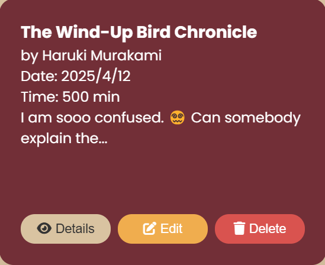
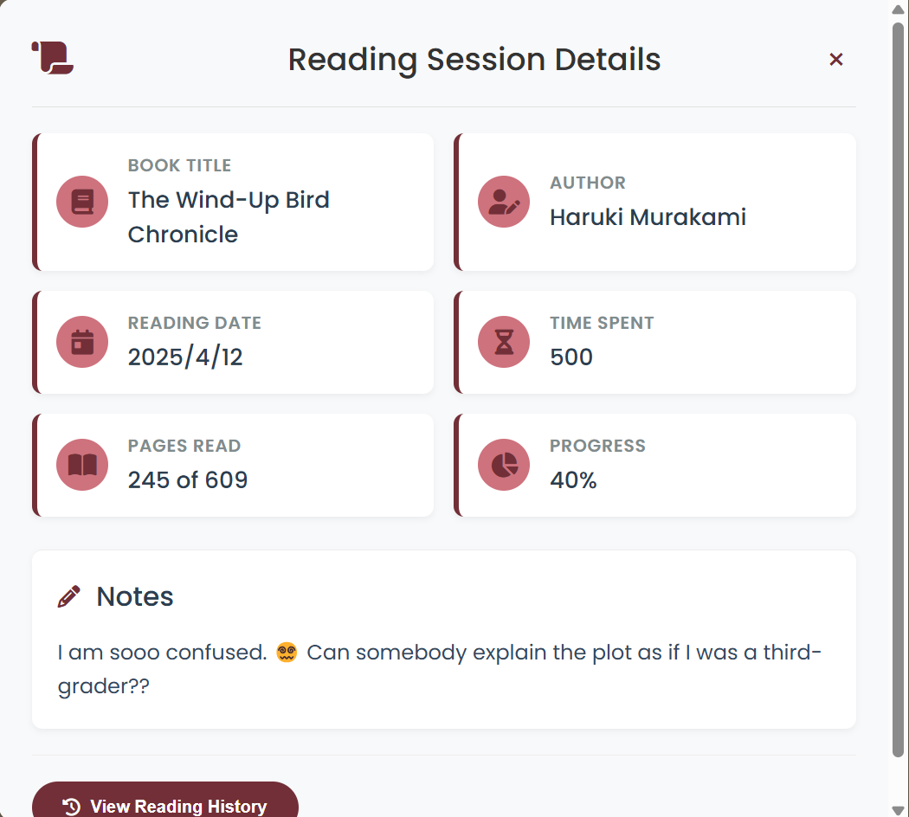
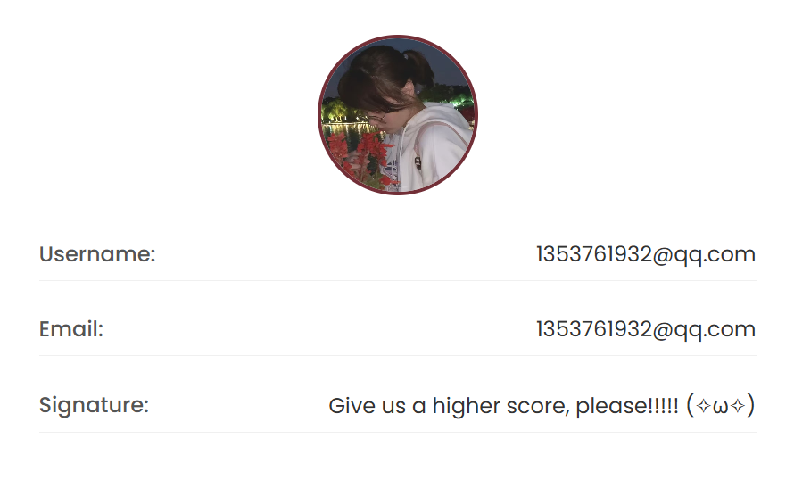

# Reading-Tracker
# 📚 Reading-Tracker

Reading-Tracker is a web-based reading activity management system designed to help users record daily reading progress, manage reading logs, and improve reading consistency through structured tracking and visualization.  
This project supports role-based access control and provides a secure and user-friendly experience for both normal users and administrators.

---

## 🚀 Key Features

- 📌 Create and manage daily reading logs
- 🕒 Track reading time and progress
- 🔍 Search and filter reading records
- 👥 Role-based access control (User / Admin)
- 🔐 Secure login and permission validation
- 📊 Reading history tracking and activity monitoring

---

## 🛠 Tech Stack

- **Backend**: Spring Boot (MVC Architecture)
- **Frontend**: HTML / CSS / JavaScript (or React/Vue if applicable)
- **Database**: MySQL
- **Security**: Spring Security + Role-based Authorization
- **API Style**: RESTful APIs

---

## 📷 Software Function Demonstration

This section provides a visual overview of the main functions implemented in the Reading-Tracker system.

### ✅ Function 1: Reading Log Creation
Users can create a new reading log by entering reading content, reading duration, and additional notes.  
This function supports structured daily tracking and ensures data consistency.

---

### ✅ Function 2: Reading Log List & Overview
The system provides a clear overview of all reading logs, allowing users to view historical records efficiently.  
Users can quickly locate reading activities and track their long-term reading habits.

---

### ✅ Function 3: Edit / Update Reading Logs
Users are able to edit existing logs to correct reading information or update progress.  
The update process ensures data integrity and is protected with permission validation.

---

### ✅ Function 4: Delete Logs with Access Control
The system allows authorized users to delete reading logs when needed.  
This operation includes role-based access control and confirmation steps to prevent accidental deletion.

---

### ✅ Function 5: Role-based Management / Admin Features
Administrators have access to advanced management functions, such as user monitoring and system-level operations.  
This ensures secure platform governance and supports multi-user usage scenarios.

---

## 📌 Project Highlights

- Designed following **Scrum development workflow**
- Built with **MVC layered architecture**
- Implements **role-based access control** to protect sensitive operations
- Supports **RESTful API communication** between frontend and backend
- Includes clear **state transition logic** for reading logs

---

## 📌 Source Code

The detailed implementation can be found in the **reading-track** branch.

👉 Please switch to branch: `reading-track`
