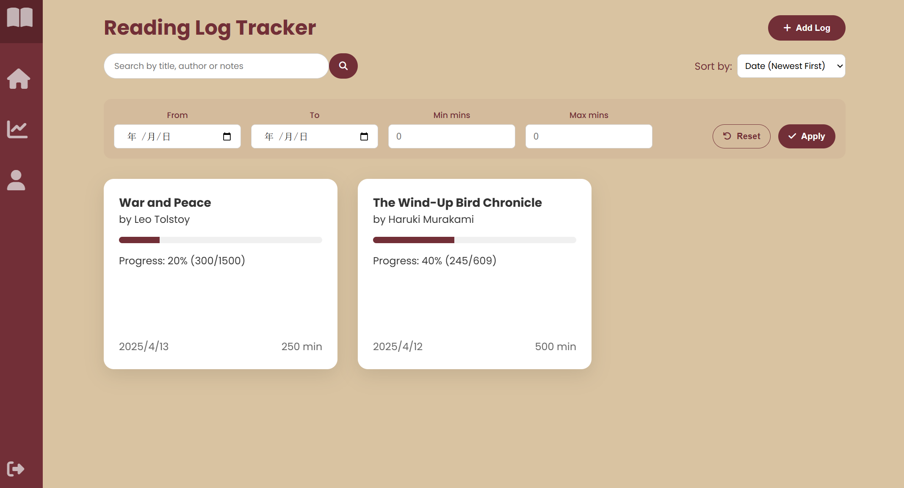

# 📚 Reading-Tracker

Reading-Tracker is a web-based reading activity management system designed to help users record daily reading progress, manage reading logs, and improve reading consistency through structured tracking and visualization.  
This project supports role-based access control and provides a secure and user-friendly experience for both normal users and administrators.

---

## 🚀 Key Features

- 📌 Create and manage daily reading logs
- 🕒 Track reading time and progress
- 🔍 Search and filter reading records
- 👥 Role-based access control (User / Admin)
- 🔐 Secure login and permission validation
- 📊 Reading history tracking and activity monitoring

---

## 🛠 Tech Stack

- **Backend**: Spring Boot (MVC Architecture)
- **Frontend**: HTML / CSS / JavaScript
- **Database**: MySQL
- **Security**: Spring Security + Role-based Authorization
- **API Style**: RESTful APIs

---

## 📷 Software Function Demonstration

This section presents key implemented features of the Reading-Tracker system through screenshots of the main user interfaces.

### ✅ Function 1: Main Dashboard (Reading Log List)
The main interface displays all reading logs created by the user in a structured list format.  
Users can easily review their reading history, check reading progress, and quickly access specific records.

---

### ✅ Function 2: Reading Log Overview & Operation Navigation
After selecting a specific reading log, the system provides an overview page that supports multiple operations.  
From this interface, users can navigate to view details, edit the log, or delete the record efficiently.

---

### ✅ Function 3: Edit Reading Log Interface
The system provides a detailed editing page where users can update reading log information, such as reading duration, notes, and content progress.  
This function ensures flexible record maintenance and supports continuous reading tracking.

---

### ✅ Function 4: Delete Reading Log (Confirmation / Secure Operation)
Users can delete unwanted or incorrect reading logs through the delete operation.  
This process includes confirmation and permission validation to prevent accidental deletion and protect user data integrity.

---

### ✅ Function 5: Personal Homepage (User Profile Page)
The personal homepage displays the user profile interface and provides quick access to individual reading-related information.  
This page improves usability by centralizing personal features and supporting personalized management.

---

## 🔐 Login and Authentication

The Reading-Tracker system includes a dedicated login interface for account authentication.  
Users must log in before accessing reading log features, ensuring that personal reading data is securely protected.  

Key security features include:  
- **Email verification** for account registration to ensure valid users.  
- **Password management**, including secure storage, password reset, and update functionality.  
- **Authentication and authorization** implemented with role-based access control to restrict sensitive operations.

---

## 📌 Source Code

The detailed implementation can be found in the **reading-track** branch.

👉 Please switch to branch: `reading-track` to view full source code.

---

## 📂 Project Structure 

The detailed implementation can be found in the **reading-track** branch.

👉 Please switch to branch: `reading-track`
